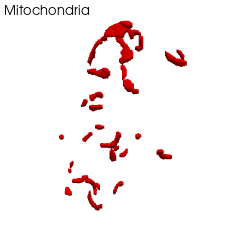
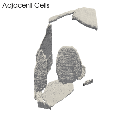

# This notebook will outline a few really cool image analysis and image visualiation techniques in Python

Firstly, I will show how to automate visualisations
I think this approach is really cool because it creates STLS from the image stacks then renders these - for me this means endless possibilities (e.g. VR - 3D printing)
Here is how you make a STL from an image stack
Load Packages:


```python 
In [1]:
from skimage import img_as_ubyte, img_as_bool, img_as_float32
import sys
import os
import numpy as np
from pandas import DataFrame
from scipy import stats
from scipy.ndimage.morphology import distance_transform_edt, binary_erosion
import skfmm
import skimage.io as io
from skimage import img_as_ubyte
from skimage.util import invert
from skimage.measure import label, regionprops, marching_cubes_lewiner, mesh_surface_area
from skimage.transform import resize
import time
from tqdm import tqdm
import joblib
import multiprocessing
import cv2
from os import listdir
import matplotlib.pyplot as plt 
#import openpnm as op
#import porespy
#import pytrax as pt
from scipy import ndimage
from stl import mesh
#import visvis as vv 
from scipy.ndimage import zoom
import pyvista as pv
from scipy.spatial import KDTree
from skimage.external import tifffile as tif
from pyvista import examples
from moviepy.editor import VideoFileClip, concatenate_videoclips
from moviepy.editor import *
import vedit
import logging
import future
import ffmpeg
from skimage.morphology import binary_dilation 
from skimage.morphology import square
from skimage.morphology import erosion, dilation, opening, closing, white_tophat
from skimage.morphology import black_tophat, skeletonize, convex_hull_image
from skimage.morphology import disk
```

Next we want to set a working directory, an image output and where the images are stored and define what sample we are working on.

```python 
os.chdir('F:/Organelle Distances/Python Output/')
output ="F:/Organelle Distances/Python Output/"
image_dir = "z:/ALLTIFS3DMIT/"
sample="D1_C1_"
```
Next, we bring in the images and reduce them - reducing them is optional and I don’t for any quantitative output. But when I am working on data vis pipelines I like working with small(ish) arrays

```python 
chl_name='D1C1CHL.tif';mit_name='D1C1MIT.tif';cell_w_org_name="D1C1VAC.tif"
cell_name="D1C1CELL.tif";air_name="D1C1AIR.tif";adj_name="D1C1ADJ.tif"

chl=io.imread(image_dir + chl_name)
chl=zoom(chl, (0.5, 0.5, 0.5)) #This is the same as Image > adjust >size in FIJI
mit = io.imread(image_dir + mit_name)
mit=zoom(mit, (0.5, 0.5, 0.5)) #This is the same as Image > adjust >size in FIJI
air = io.imread(image_dir + air_name)
air=zoom(air, (0.5, 0.5, 0.5)) #This is the same as Image > adjust >size in FIJI
adj = io.imread(image_dir + adj_name)
adj=zoom(adj, (0.5, 0.5, 0.5)) #This is the same as Image > adjust >size in FIJI
```
“zoom” is just the same as adjust size in ImageJ. Our initial voxel size for these e.g. images was 6nm, 6nm 50nm. But before segmenting I reduced them to 20nm,20nm 50nm. At this stage I was using a core facility computer. For this analysis I reduce them to 40nm, 40nm, 100nm.
Define voxel values in um


```python 
X=0.04
Y=0.04
Z=0.1
```

The above images are binary- a voxel is an organelle or tissue or it is not. The folowing code creates a 3D mesh. H This runs the "marching cubes" algorithim which "extracts a polygonal mesh of an isosurface from a three-dimensional discrete scalar field (sometimes called a voxel). 
Here are the resources I used https://en.wikipedia.org/wiki/Marching_cubes https://scikit-image.org/docs/dev/auto_examples/edges/plot_marching_cubes.html

Create the mesh:

```python 
vertices, faces, normals, values = marching_cubes_lewiner(chl, level=None,
                                                          spacing=(Z, X,Y), gradient_direction='descent', step_size=1, 
                                                          allow_degenerate=True, use_classic=False) 
chlmesh = mesh.Mesh(np.zeros(faces.shape[0], dtype=mesh.Mesh.dtype))
for i, f in enumerate(faces):
    for j in range(3):
        chlmesh .vectors[i][j] = vertices[f[j],:]
```
save the mesh as an STL

```python 
chlmesh.save(sample +'chl3D.stl')
```
and then read it in again 
```python 
CHLstl = pv.read(output+sample +"chl3D.stl")
```

Now we can see the chloroplasts in 3D - Note that the a HQ image is saved but I am showing GIFs here cause they are nicer :) the code to make the gifs is at the end of the readme

```python
pv.set_plot_theme("document")
p = pv.Plotter()
p.add_mesh(CHLstl, color="green", opacity=1)
p.window_size = 500, 500
p.show(screenshot=sample+"   Image1.tiff", window_size=[2400,2400])
```


Now we do the same for the mitochondria 
```python 
vertices, faces, normals, values = marching_cubes_lewiner(mit, level=None, spacing=(Z, X,Y),
                                                          gradient_direction='descent', step_size=1, allow_degenerate=True,
                                                          use_classic=False) 
mitmesh = mesh.Mesh(np.zeros(faces.shape[0], dtype=mesh.Mesh.dtype))
for i, f in enumerate(faces):
    for j in range(3):
        mitmesh .vectors[i][j] = vertices[f[j],:]
```

```python 
mitmesh.save(sample +'mit3D.stl')
MITstl = pv.read(output+sample +"mit3D.stl")
```
```python 
pv.set_plot_theme("document")
p = pv.Plotter()
p.add_mesh(MITstl, color="red", opacity=1)
p.window_size = 400, 400
p.show(screenshot=sample+"   Image2.tiff", window_size=[2400,2400])
```



Because later I am going to get distance metrics for multiple things in regard to mitochondria (the distance data is added to the array) I create some duplicates


```python 
MITstl1=MITstl
MITstl2=MITstl
MITstl3=MITstl
```
I made the airspace by blocking the cell and adjacent cells and expanding the cells but I made it too thin to make an STL after the image reduction. So instead of going back to Avizo I just make the line a little thicker. That is, I dilate it a few times

```python 
aird=air
aird=ndimage.binary_dilation(aird).astype(aird.dtype)
aird=ndimage.binary_dilation(aird).astype(aird.dtype)
aird=ndimage.binary_dilation(aird).astype(aird.dtype)
plt.imshow(aird[60])

vertices, faces, normals, values = marching_cubes_lewiner(aird, level=None, spacing=(Z, X,Y)
                                                          , gradient_direction='descent', step_size=1, allow_degenerate=True,
                                                          use_classic=False) 
airmesh = mesh.Mesh(np.zeros(faces.shape[0], dtype=mesh.Mesh.dtype))
for i, f in enumerate(faces):
    for j in range(3):
        airmesh .vectors[i][j] = vertices[f[j],:]
```
airmesh.save(sample +'air3D.stl')
AIRstl = pv.read(output+sample +"air3D.stl")

```python 
pv.set_plot_theme("document")
p = pv.Plotter()
p.add_mesh(AIRstl, color="blue", opacity=1)
p.window_size = 500, 500
p.show(screenshot=sample+"   Image3.tiff", window_size=[2400,2400])
```


Now I create the adjacent cells

```python 
vertices, faces, normals, values = marching_cubes_lewiner(adj, level=None, spacing=(Z, X,Y)
                                                          , gradient_direction='descent', step_size=1, allow_degenerate=True,
                                                          use_classic=False) 
adjmesh = mesh.Mesh(np.zeros(faces.shape[0], dtype=mesh.Mesh.dtype))
for i, f in enumerate(faces):
    for j in range(3):
        adjmesh .vectors[i][j] = vertices[f[j],:]
```
```python 
adjmesh.save(sample +'adj3D.stl')
ADJstl = pv.read(output+sample +"adj3D.stl")
```
```python 
pv.set_plot_theme("document")
p = pv.Plotter()
p.add_mesh(ADJstl, color="grey", opacity=1)
p.window_size = 2400, 2400
p.show(screenshot=sample+"   Image4.tiff", window_size=[2400,2400])
```



By default the cell wall is just the adjacent cells + the airspace

```python 
CWstl=ADJstl+AIRstl
```
The above creates the 3D geometry, now the goal is the quantify the distances. In the paper I do it from the raw images but for the visualisations I used the 3D objects- there is no real difference. Here is a brief background on the method 
The images were converted to surfaces and a k-dimensional tree (k-d-tree) was used to calculate the nearest neighbour distance. A k-d-tree is a data frame where every leaf node (in the case of this study the organelle surfaces, Figure 2a) is a k-dimensional point. The algorithm sub-sets the data, creates a query point (in the case of this study a voxel on the surface of an organelle, e.g. a mitochondria). This is then coupled with a nearest neighbour search which will find a point closet to the query point (in the case of this study a voxel on the surface of another anatomical feature e.g. a chloroplast or the airspace.

I used the "Pyvista" package - the examples are fantastic https://docs.pyvista.org/examples/01-filter/distance-between-surfaces.html

I start by getting the distance from the mitochondria surface to the chloroplasts


```python 
tree = KDTree(CHLstl.points)
d, idx = tree.query(MITstl1.points )
MITstl1["Distance (um)"] = d
```
Now we want to save each voxels distance data in a CSV

```python 
print("saving each points differences in nm")
np.savetxt(sample+"Mit-CHL.csv", d, delimiter=",")
```
And create a dataframe with the distances 

```python 
chldistances=MITstl1
```
For the distance plots we need a scale bar

```python 
sargs = dict(
    title_font_size=80,
    label_font_size=80,
    shadow=True,
    n_labels=5,
    italic=True,
    fmt="%.1f",
    font_family="arial",height=0.5, 
    vertical=True, 
    position_x=0.1,
    position_y=0.8
)

boring_cmap = plt.cm.get_cmap("jet", 50) #somebody called this scale bar boring -- I dont think so but for some reason I 
# kept that name 
```

```python 
print(sample + "The Distance from mit to chl")
pv.set_plot_theme("document")
p = pv.Plotter()
p.set_background("white")
p.add_mesh(chldistances, scalars="Distance (um)",scalar_bar_args=sargs, cmap=boring_cmap )
p.window_size = 500, 500
p.show(screenshot=sample+"   Image6a.tiff", window_size=[2400,2400])
```


We now calculate the distance from the Mit to the CW

```python 
tree2 = KDTree(CWstl.points)
d2, idx = tree2.query(MITstl2.points )
MITstl2["Distance (um)"] = d2
```
```python 
np.savetxt(sample+"Mit-CW.csv", d2, delimiter=",")
```
```python 
cwdistances=MITstl2
```
```python 
print(sample + "The Distance from mit to cw")
pv.set_plot_theme("document")
p = pv.Plotter()
p.set_background("white")
p.add_mesh(cwdistances, scalars="Distance (um)",scalar_bar_args=sargs, cmap=boring_cmap )
#p.add_mesh(chldistances, scalars="Distance (um)" )
#p.add_mesh(CHLstl, color="green", opacity=0.1)
p.window_size = 500, 500
p.show(screenshot=sample+"   Image7.tiff", window_size=[2400,2400])
```


We now calculate the distance from the Mit to the Airspace
```python
tree3 = KDTree(AIRstl.points)
d3, idx = tree3.query(MITstl3.points )
MITstl3["Distance (um)"] = d3
```
```python 
np.savetxt(sample+"Mit-AIR.csv", d3, delimiter=",")
```
```python 
airdistances=MITstl3
```
```python 
pv.set_plot_theme("document")
p = pv.Plotter()
p.set_background("white")
p.add_mesh(airdistances, scalars="Distance (um)",scalar_bar_args=sargs, cmap=boring_cmap )
#p.add_mesh(AIRstl, color="grey", opacity=0.1)
p.window_size = 500, 500
p.show(screenshot=sample+"   Image8.tiff", window_size=[2400,2400])
````


Now for each mitochondria surface we have 3 Values 
1) distance to nearest chl
2) distance to nearest airspace
3) distance to nearest cell wall
The last piece of info we want is the distance from the CHL surfaces to the airspace

```python 
tree4 = KDTree(AIRstl.points)
d4, idx = tree4.query(CHLstl.points )
CHLstl["Distance (um)"] = d4
```

```python 
np.savetxt(sample+"CHL-AIR.csv", d4, delimiter=",")
```
```python 
SC=CHLstl
```
```python 
print(sample + "The Distance from chl to air")
pv.set_plot_theme("document")
p = pv.Plotter()
p.set_background("white")
p.add_mesh(SC, scalars="Distance (um)",scalar_bar_args=sargs, cmap=boring_cmap )
p.window_size = 500, 500
p.show(screenshot=sample+"   Image9a.tiff", window_size=[2400,2400])
```


Lastly this code is really asy to alter to create movies or gifs

```python 
#MIT Movie
plotter = pv.Plotter()
plotter.add_mesh(MITstl, color="red")
path = plotter.generate_orbital_path(n_points=200, shift=chldistances.length)
plotter.add_text("Mitochondria", font_size=8)
plotter.window_size = 240, 240
plotter.open_gif(sample+'MIT.gif')
plotter.orbit_on_path(path, write_frames=True)
plotter.close()
video2=VideoFileClip(sample+"MIT.gif")
```


